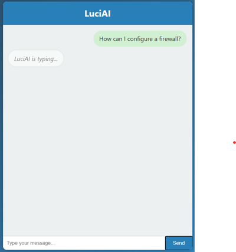

# LuciAI

**LuciAI** is an experimental project demonstrating how OpenAI’s API can run on OpenWrt using a lightweight Python setup.  
A basic Flask app deployed on a router allows interaction with OpenAI models via a minimal chat UI, showcasing AI integration in constrained or embedded systems.



---

## Device and Firmware

This project was tested on a **Netgear Nighthawk X6 R8000** router running **OpenWrt 22.03.5**.

To install OpenWrt on this device, please refer to the official OpenWrt guide:  
🔗 https://openwrt.org/toh/netgear/r8000

---

## Prerequisites

### On the OpenWrt Router

- **Python 3** is required. This project was tested with **Python 3.10.13**.  
  You can find the OpenWrt package here:  
  🔗 https://openwrt.org/packages/pkgdata/python3

---

## How to Run the Project

### Option 1: Upload the Full Project Folder

1. Copy the entire `LuciAI` folder to your OpenWrt router:
   ```bash
   scp -r ./LuciAI/ root@192.168.2.1:/root
   ```

2. Connect via SSH and navigate to the project:
   ```bash
   ssh root@192.168.2.1
   cd LuciAI/
   ```

3. Activate the virtual environment:
   ```bash
   source venv/bin/activate
   ```

4. Insert your OpenAI API key into `application/routes.py`:
   ```bash
   nano application/routes.py
   # Replace "YOUR_OPENAI_API_KEY" with your actual key
   ```

5. Run the application:
   ```bash
   python3.10 run.py
   ```

---

### Option 2: Manual Setup (Virtual Environment)

If you prefer to upload specific files and set up the environment manually:

1. SSH into the router and prepare the project directory:
   ```bash
   cd ~
   mkdir LuciAI
   cd LuciAI
   ```

2. Create and activate a virtual environment:
   ```bash
   pip install virtualenv
   virtualenv venv
   source venv/bin/activate
   ```

3. Install required packages:
   ```bash
   pip install pydantic==1.9.0
   pip install openai==1.38.0
   pip uninstall httpx
   pip install httpx==0.27.0
   pip install Flask
   ```

4. Run the app:
   ```bash
   python3.10 run.py
   ```

---

## Notes

- This is an experimental and minimal implementation, intended for learning and exploration.
- Contributions and suggestions are welcome!
